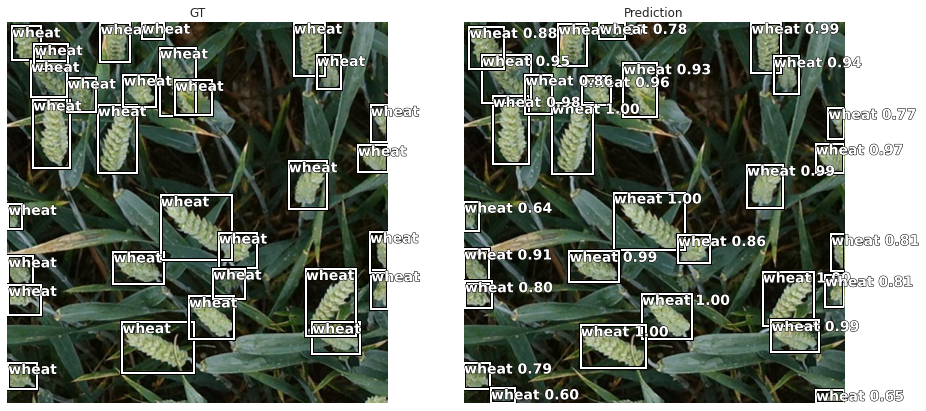

<a href="https://colab.research.google.com/github/shadab4150/Global_wheat_detection/blob/master/Global_wheat_detection_%7C_A_new_perspective.ipynb" target="_parent"></a>


```python
from google.colab import files

uploaded = files.upload()

for fn in uploaded.keys():
  print('User uploaded file "{name}" with length {length} bytes'.format(name=fn, length=len(uploaded[fn])))
  
# Then move kaggle.json into the folder where the API expects to find it.
!mkdir -p ~/.kaggle/ && mv kaggle.json ~/.kaggle/ && chmod 600 ~/.kaggle/kaggle.json

# Example

# !kaggle competitions download -c "jigsaw-unintended-bias-in-toxicity-classification"
```
```python
import kaggle
kaggle.api.authenticate()
kaggle.api.competition_download_files("global-wheat-detection", path='/content/', quiet=False)
```

      1%|          | 7.00M/607M [00:00<00:09, 69.3MB/s]

    Downloading global-wheat-detection.zip to /content
    

    100%|██████████| 607M/607M [00:03<00:00, 202MB/s]

    
    

    
    


```python
!unzip '/content/global-wheat-detection.zip' -d '/content/wheat'
```


```python
from google.colab import drive
drive.mount('/content/drive')
```

```python
!cp '/content/global-wheat-detection.zip' '/content/drive/My Drive/Dataset'
```


```python
!pip install object-detection-fastai
```


```python

import numpy as np # linear algebra
import pandas as pd # data processing, CSV file I/O (e.g. pd.read_csv)
from collections import defaultdict
import os
from fastai import *
from fastai.vision import *
from fastai.callbacks import *
import seaborn as sns 
import matplotlib.pyplot as plt
import matplotlib.image as immg
from sklearn.model_selection import StratifiedKFold,KFold

from object_detection_fastai.helper.object_detection_helper import *
from object_detection_fastai.loss.RetinaNetFocalLoss import RetinaNetFocalLoss
from object_detection_fastai.models.RetinaNet import RetinaNet
from object_detection_fastai.callbacks.callbacks import BBLossMetrics, BBMetrics, PascalVOCMetric
```


```python
path = Path('/content/wheat');path.ls()
```


    [PosixPath('/content/wheat/train'),
     PosixPath('/content/wheat/train.csv'),
     PosixPath('/content/wheat/test'),
     PosixPath('/content/wheat/sample_submission.csv')]


```python
sns.set_style('darkgrid')
```


```python
train = pd.read_csv(path/'train.csv')
```


```python
train.head()
```


<div>

<table border="1" class="dataframe">
  <thead>
    <tr style="text-align: right;">
      <th></th>
      <th>image_id</th>
      <th>width</th>
      <th>height</th>
      <th>bbox</th>
      <th>source</th>
    </tr>
  </thead>
  <tbody>
    <tr>
      <th>0</th>
      <td>b6ab77fd7</td>
      <td>1024</td>
      <td>1024</td>
      <td>[834.0, 222.0, 56.0, 36.0]</td>
      <td>usask_1</td>
    </tr>
    <tr>
      <th>1</th>
      <td>b6ab77fd7</td>
      <td>1024</td>
      <td>1024</td>
      <td>[226.0, 548.0, 130.0, 58.0]</td>
      <td>usask_1</td>
    </tr>
    <tr>
      <th>2</th>
      <td>b6ab77fd7</td>
      <td>1024</td>
      <td>1024</td>
      <td>[377.0, 504.0, 74.0, 160.0]</td>
      <td>usask_1</td>
    </tr>
    <tr>
      <th>3</th>
      <td>b6ab77fd7</td>
      <td>1024</td>
      <td>1024</td>
      <td>[834.0, 95.0, 109.0, 107.0]</td>
      <td>usask_1</td>
    </tr>
    <tr>
      <th>4</th>
      <td>b6ab77fd7</td>
      <td>1024</td>
      <td>1024</td>
      <td>[26.0, 144.0, 124.0, 117.0]</td>
      <td>usask_1</td>
    </tr>
  </tbody>
</table>
</div>


```python
tr = train.image_id.value_counts()
tr = pd.DataFrame({'image_id':tr.index,'wheat_count':tr.values})
tr = tr.sample(frac=1.,random_state=2020)
```


```python
fnames = get_files(path/'train')
```


```python
def get_lbl_img(train):
    wheat2bbox = {}
    train['label'] = 'wheat'
    grp = train.image_id.unique()
    tr_gr = train.groupby(['image_id'])
    from tqdm.notebook import tqdm
    for i in tqdm(range(len(grp))):
        name = str(grp[i]) + '.jpg'
        bbox = []
        temp_b = []
        temp = tr_gr.get_group(grp[i])
        tt = temp.loc[:,'bbox'].values
        for j in range(len(temp)):
            t = tt[j][1:-1].split(',')
            t = [float(x) for x in t]
            t[2],t[3] = t[0]+t[2],t[1]+t[3]
            t1 = [t[1],t[0],t[3],t[2]]   # inverse in fromat w,h
            temp_b.append(t1)
        bbox.append(temp_b)
        bbox.append(['wheat']*len(temp))
        wheat2bbox[name] = bbox
    return wheat2bbox
```


```python
wheat2bbox = get_lbl_img(train)
```


    HBox(children=(FloatProgress(value=0.0, max=3373.0), HTML(value='')))


    
    


```python
get_y_func = lambda o:wheat2bbox[Path(o).name]
```


```python
data = (ObjectItemList.from_df(tr,path, folder = 'train' , suffix = '.jpg',cols='image_id')
        #Where are the images? 
        .split_by_rand_pct(0.1)                          
        #How to split in train/valid? -> randomly with the default 20% in valid
        .label_from_func(get_y_func)
        #How to find the labels? -> use get_y_func on the file name of the data
        .transform(size = 512, tfm_y=True)
        #Data augmentation? -> Standard transforms; also transform the label images
        .databunch(bs=4, collate_fn=bb_pad_collate))   
```


```python
data.show_batch(2 , figsize = (20,15) )
```


### What Is an Anchor Box?
* **Anchor boxes are a set of predefined bounding boxes of a certain height and width. These boxes are defined to capture the scale and aspect ratio of specific object classes you want to detect** and are typically chosen based on object sizes in your training datasets. During detection, the predefined anchor boxes are tiled across the image. The network predicts the probability and other attributes, such as background, intersection over union (IoU) and offsets for every tiled anchor box. The predictions are used to refine each individual anchor box. You can define several anchor boxes, each for a different object size. Anchor boxes are fixed initial boundary box guesses.

* **The network does not directly predict bounding boxes, but rather predicts the probabilities and refinements that correspond to the tiled anchor boxes.** The network returns a unique set of predictions for every anchor box defined. The final feature map represents object detections for each class. The use of anchor boxes enables a network to detect multiple objects, objects of different scales, and overlapping objects.

### Advantage of Using Anchor Boxes
* When using anchor boxes, you can evaluate all object predictions at once. Anchor boxes eliminate the need to scan an image with a sliding window that computes a separate prediction at every potential position. 


```python
anchors = create_anchors(sizes=[(32,32),(16,16),(8,8),(4,4)], ratios=[0.5, 1, 2], scales=[0.45, 0.55, 0.75, 0.95, 1.05, 1.15])
```


```python
size = 512
```


```python
fig,ax = plt.subplots(figsize=(10,10))
ax.imshow(image2np(data.valid_ds[0][0].data))

for i, bbox in enumerate(anchors[:18]):
    bb = bbox.numpy()
    x = (bb[0] + 1) * size / 2 
    y = (bb[1] + 1) * size / 2 
    w = bb[2] * size / 2
    h = bb[3] * size / 2
    
    rect = [x,y,w,h]
    draw_rect(ax,rect)
```


```python
len(anchors)
```


    24480


```python
n_classes = data.train_ds.c

crit = RetinaNetFocalLoss(anchors)

encoder = create_body(models.resnet50, True, -2)

model = RetinaNet(encoder, n_classes=data.train_ds.c, n_anchors=18, sizes=[32,16,8,4], chs=32, final_bias = -4., n_conv = 2)
```

    Downloading: "https://download.pytorch.org/models/resnet50-19c8e357.pth" to /root/.cache/torch/checkpoints/resnet50-19c8e357.pth


```python
voc = PascalVOCMetric(anchors, size, [i for i in data.train_ds.y.classes[1:]])
learn = Learner(data, model, loss_func=crit,
                callback_fns=[ShowGraph,BBMetrics],
                metrics=[voc],model_dir = '/content/')
```


```python
learn.split([model.encoder[6], model.c5top5]);
#learn.freeze_to(-2)
```


```python
learn.lr_find()
learn.recorder.plot()
```

<table border="1" class="dataframe">
  <thead>
    <tr style="text-align: left;">
      <th>epoch</th>
      <th>train_loss</th>
      <th>valid_loss</th>
      <th>pascal_voc_metric</th>
      <th>BBloss</th>
      <th>focal_loss</th>
      <th>AP-wheat</th>
      <th>time</th>
    </tr>
  </thead>
  <tbody>
  </tbody>
</table><p>


    LR Finder is complete, type {learner_name}.recorder.plot() to see the graph.
    


```python
gc.collect()
```


    1042


```python
learn.unfreeze()
learn.fit_one_cycle(5, 1e-3)
```


<table border="1" class="dataframe">
  <thead>
    <tr style="text-align: left;">
      <th>epoch</th>
      <th>train_loss</th>
      <th>valid_loss</th>
      <th>pascal_voc_metric</th>
      <th>BBloss</th>
      <th>focal_loss</th>
      <th>AP-wheat</th>
      <th>time</th>
    </tr>
  </thead>
  <tbody>
    <tr>
      <td>0</td>
      <td>0.298881</td>
      <td>0.413297</td>
      <td>0.197320</td>
      <td>0.202524</td>
      <td>0.210773</td>
      <td>0.197320</td>
      <td>03:38</td>
    </tr>
    <tr>
      <td>1</td>
      <td>0.345848</td>
      <td>0.727793</td>
      <td>0.235912</td>
      <td>0.279782</td>
      <td>0.448011</td>
      <td>0.235912</td>
      <td>03:41</td>
    </tr>
    <tr>
      <td>2</td>
      <td>0.299872</td>
      <td>0.420068</td>
      <td>0.201523</td>
      <td>0.201362</td>
      <td>0.218707</td>
      <td>0.201523</td>
      <td>03:38</td>
    </tr>
    <tr>
      <td>3</td>
      <td>0.216017</td>
      <td>0.414520</td>
      <td>0.208631</td>
      <td>0.198756</td>
      <td>0.215765</td>
      <td>0.208631</td>
      <td>03:39</td>
    </tr>
    <tr>
      <td>4</td>
      <td>0.167580</td>
      <td>0.443744</td>
      <td>0.221646</td>
      <td>0.201662</td>
      <td>0.242081</td>
      <td>0.221646</td>
      <td>03:40</td>
    </tr>
  </tbody>
</table>


    Detections: 100%|██████████| 3866/3866 [00:04<00:00, 814.62it/s]
    GT: 100%|██████████| 15265/15265 [00:05<00:00, 2725.01it/s]
    


    Detections: 100%|██████████| 4454/4454 [00:05<00:00, 813.73it/s]
    GT: 100%|██████████| 15265/15265 [00:06<00:00, 2209.09it/s]
    Detections: 100%|██████████| 3918/3918 [00:04<00:00, 821.43it/s]
    GT: 100%|██████████| 15265/15265 [00:05<00:00, 2644.74it/s]
    Detections: 100%|██████████| 3963/3963 [00:04<00:00, 817.81it/s]
    GT: 100%|██████████| 15265/15265 [00:05<00:00, 2642.76it/s]
    Detections: 100%|██████████| 4085/4085 [00:04<00:00, 817.99it/s]
    GT: 100%|██████████| 15265/15265 [00:06<00:00, 2538.02it/s]
    


```python
learn.recorder.plot_losses()
```


```python
show_results_side_by_side(learn, anchors, detect_thresh=0.5, nms_thresh=0.1, image_count=4)
```





```python

```
